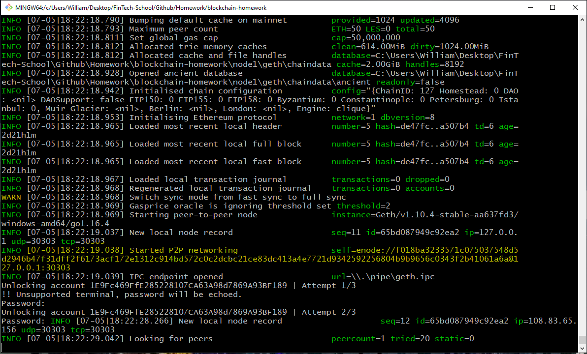

# Blockchain Building Blocks Homework

### Enviroment setup
- Step 1: Make dir for new blockchain (e.g. *mkdir blockchain*)
- Step 2: Download latest Geth & Tools release for your Operating System and unzip .exe file into step 1 directory
- Step 3: 

### - Explain the configuration of the network, such as it's blocktime, chain ID, account passwords, ports, etc.

### - Explain how to connect MyCrypto to your network and demonstrate (via screenshots and steps) and send a transaction.

## Start Node1
* Start the first node by opening a new terminal and running the following command:

  ```sh
  ./geth --datadir node1 --unlock "SEALER_ONE_ADDRESS" --mine --miner.threads 1
  ```

*  Substitute the "SEALER_ONE_ADDRESS" with the the public address of the first node that was created in the previous session (do **not** include the leading `0x`).

* Example:

  ```sh
  ./geth --datadir node1 --unlock "1E9Fc469FfE285228107CA63A98d7869A93BF189" --mine --miner.threads 1
  ```

* **Important:** Type your password and hit enter - _even if you don't see a prompt!_

* Copy the resulting enode address from the terminal:


   

---


## Start Node2

Commands differ based on OS; choose your system below.

<details><summary>Windows</summary>

* Start node two by opening a second new terminal and running the following command: 

  ```sh
  ./geth --datadir node2 --unlock "SEALER_TWO_ADDRESS" --port 30304 --http --bootnodes "SEALER_ONE_ENODE_ADDRESS"  --ipcdisable --allow-insecure-unlock --mine --miner.threads 1
  ```

* For example:

  ```sh
  ./geth --datadir node2 --unlock "B1F8B855dD47239Ef8eC38304753E9Bc75DB2212" --port 30304 --http --bootnodes "enode://f018ba3233571c075037548d5d2946b47f31dff2f6173acf172e1312c914bd572c0c2dcbc21ce83dc413a4e7721d9342592256804b9b9656c0343f2b41061a6a@127.0.0.1:30303"  --ipcdisable --allow-insecure-unlock --mine --miner.threads 1
  ```

* **Important**: Type your password and hit enter - _even if you don't see a prompt!_

* The chain should be up and running after you start the second node.

</details>

## Geth Flags Used
- --datadir ***value***
Data directory for the databases and keystore

- --unlock ***value***
Comma separated list of accounts to unlock

- --mine
Enable mining

- --miner.threads ***value***
Number of CPU threads to use for mining (default: 0)

- --port ***value***
Network listening port (default: 30303)

- --rpc
Enable the HTTP-RPC server (deprecated and will be removed June 2021, use --http)

- --http
Enable the HTTP-RPC server

- --bootnodes ***value***
Comma separated enode URLs for P2P discovery bootstrap

- --ipcdisable
Disable the IPC-RPC server
